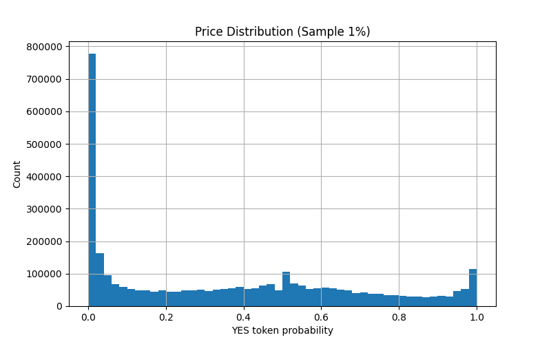
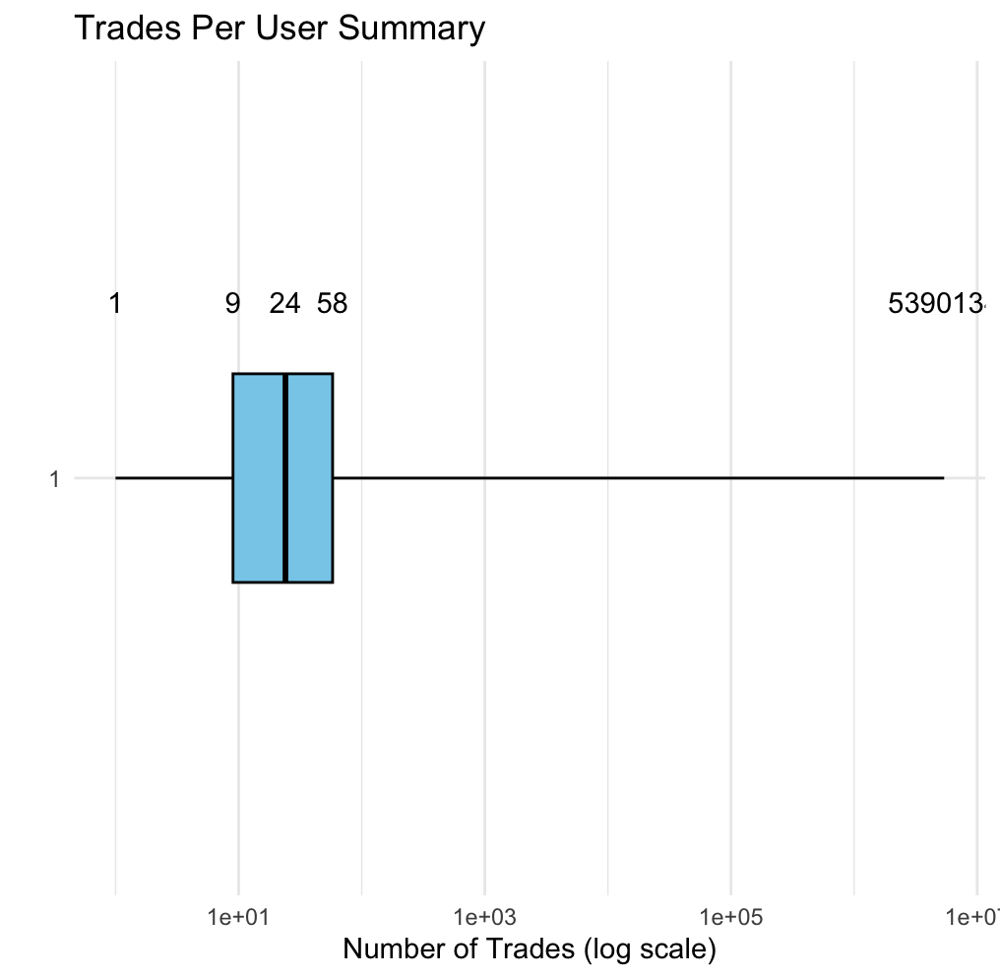
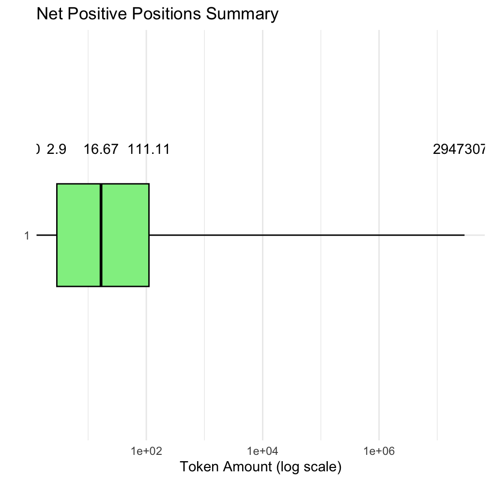
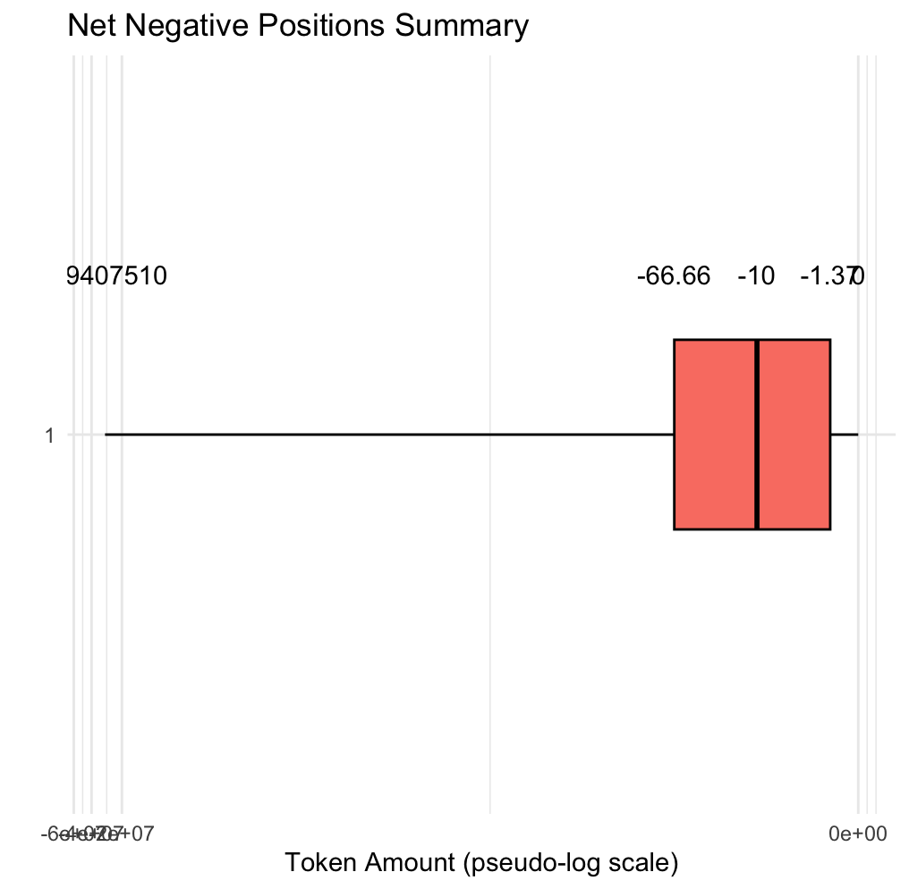
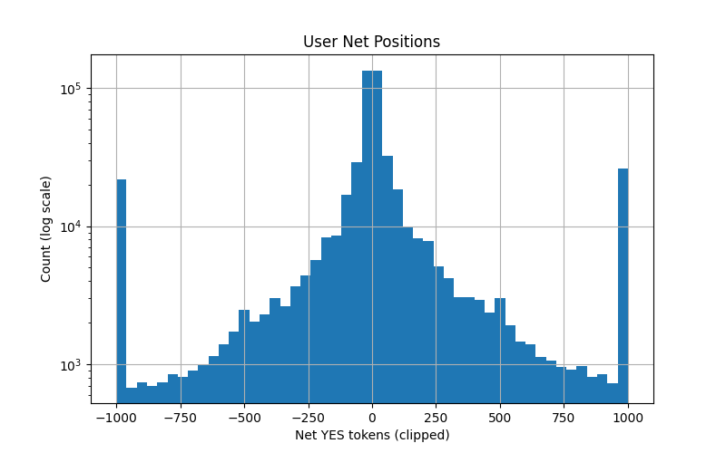

### **Dataset Overview**

The dataset, sourced from **Hugging Face** by the user *SII-WANGZI* is a user-level trading records from Polymarket, containing of 340,551,936 rows after maker/taker expansion. The parquet is 28.93 GB.

**Key Columns**:

-   `timestamp`, `datetime`, `block_number`, `transaction_hash`, `event_id`, `market_id`, `condition_id`, `user`, `role`, `price`, `token_amount`, `usd_amount`

**Script**: Full script on Github: [Script](https://github.com/sylviadu2552/CSC369/blob/final-project/Final%20Project/final_EDA.py)

### **Data Cleaning**

The dataset was already pre-cleaned, and as described in the data documentation:

1.  **Removed invalid trades**:

    -   NaN prices removed

    -   Contract-to-contract trades removed

2.  **Split trades by user role**:

    -   Each trade → 2 rows: maker + taker

    -   Preserved maker/taker information

3.  **Unified YES-token perspective**:

    -   All trades normalized to probability of YES (`token1`) outcome

    -   Original NO token trades flipped (`price = 1 - price`)

4.  **Unified trading direction**:

    -   All SELL trades converted to negative token amounts

    -   All rows labeled as BUY

5.  **Sorted by user and timestamp**

    -   Allows sequential analysis of trading trajectories

**Conclusion:** No additional cleaning were required for missing data or formatting issues and I believed the dataset to be ready for exploratory analysis.

### **Exploratory Data Analysis (EDA)**

> Note: Plots are generated on a 1% random sample to avoid memory issues. All numeric summaries are computed on the full dataset using Dask.

**Missing Values**: Double checked missing values to ensure the documentation was correct and the dataset was actually complete.

**Price Distribution**: Double checked that YES-token probabilities were actually normalized.

-   **Range**: 0.00 -\> 1.00 ; normalization successful/confirmed

-   **Observation**: The price distribution is **heavily right-skewed**, with the vast majority of trades concentrated between 0.0 and 0.1.

    ```{r}
    
    ```

    -   Most users are placing low-probability YES bets, meaning they are betting on outcomes that the market currently estimates as unlikely.
    -   The other peaks occur at around 0.5 and 1.

**Token Amount Distribution**:

-   **Range**: -4,215,096 → +4,215,096

-   **Median user trades**: \~24 tokens

-   **Total Unique Users:** \~1.76 million

-   **Observation:** Highly skewed distribution; small number of users dominate trading

    ```{r}
    
    ```

**Net Positions:**

-   Positive Positions:

    ```{r}
    
    ```

<!-- -->

-   Negative Positions:

    ```{r}
    
    ```

-   Overall:

    ```{r}
    
    ```

**Role Distribution:** Double checked maker/take distribution was exactly 50/50, confirming one to one trade integrity.

**Time Coverage:**

-   Earliest trade: 2022-11-21 19:49:29

-   Latest trade: 2025-12-30 05:55:05

**Top 10 Active Users:**

| Rank | User ID                                    | Trades    |
|------|--------------------------------------------|-----------|
| 1    | 0x6031B6eed1C97e853c6e0F03Ad3ce3529351F96d | 5,390,134 |
| 2    | 0xca85f4b9e472B542e1DF039594eeAebb6d466bF2 | 2,906,358 |
| 3    | 0xD218E474776403A330142299f7796E8BA32Eb5C9 | 2,322,396 |
| 4    | 0xd44e29936409019F93993de8bd603EF6CB1BB15e | 2,276,078 |
| 5    | 0x7F69983eB28245Bba0D5083502a78744a8f66162 | 2,253,189 |
| 6    | 0xf0b0eF1D6320C6bE896B4c9C54dd74407e7f8cAB | 2,150,150 |
| 7    | 0x51373c6B56e4a38bF97c301efbfF840fc8451556 | 2,093,844 |
| 8    | 0xE8Dd7741CCB12350957Ec71E9EE332E0D1E6eC86 | 1,922,765 |
| 9    | 0x23cb796cf58Bfa12352F0164f479deedbd50658E | 1,631,297 |
| 10   | 0x557bEd924A1bB6F62842C5742d1dc789B8D480d4 | 1,533,188 |

### **Data Quality Issues**

The dataset has some extreme outliers in both `token_amount` and net positions, which can skew averages, standard deviations, and plots. To handle this, log scaling and clipped ranges were applied in the histograms, and whale or bot activity was flagged for awareness. The number of trades per user is also heavily skewed, so simple averages don’t accurately reflect typical user behavior. Medians, quantiles, and the top 1% of users were examined separately to account for this.

The dataset is also very large (\~23GB, 340 million rows), making in-memory operations with Pandas impractical. Dask was used for lazy loading, aggregation, and sampled plotting. Another consideration is the potential bias from whales or algorithmic traders, which could misrepresent normal user behavior; this was noted during the EDA and may be addressed in further analysis. The heavy-tailed distributions in trade counts and net positions compress standard histograms, so log scaling and clipping help show the main body of the data more clearly.

The EDA shows that a small number of users dominate trading volume, while most users trade relatively little (fewer than 50 tokens). This highlights why medians and quantiles are more informative than means. Because the data is sorted by user and timestamp, sequential analysis of user activity is possible. Overall, log scaling is essential for visualizing trade counts and net positions, ensuring both typical users and extreme outliers are properly represented.
