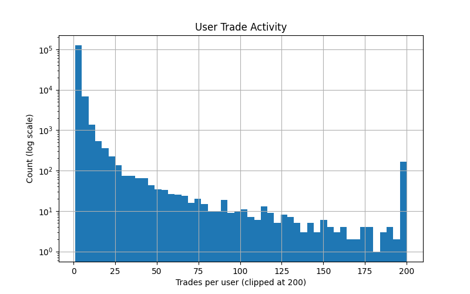

# Final Project Whitepaper: User Trading Analysis

## Introduction

This study investigates patterns of user trading behavior across Polymarket, a global cryptocurrency-based prediction market, during the year 2024. The goal is to determine whether active users exhibit distinguishable trading patterns and how market activity influences trade size and frequency.

The central hypothesis is that a small fraction of highly active users drives most of the trading volume, and that trading style and risk-taking behavior strongly influence profitability. Specifically, we examine whether users who frequently act as “makers” and avoid very low-probability trades earn higher profits, and whether clusters of users exhibit distinct behavioral patterns.

## Data Filtering and Preparation

To ensure meaningful analysis, the raw dataset of user trades was carefully filtered to remove noise and focus on relevant activity:

1. **Time Filtering**  
   Only trades occurring between January 1, 2024, and December 31, 2024, were retained. This limits the analysis to a consistent, recent time period and eliminates outdated data that could bias results.

2. **Removal of Micro Trades**  
   Trades involving negligible token amounts (≤1) were excluded. These small trades often represent noise, automated testing, or outliers that do not reflect meaningful user behavior.

3. **Focus on Active Markets**  
   Markets with fewer than 5,000 trades were excluded. By concentrating on liquid, high-volume markets, the analysis captures environments where trading behavior is most significant.

4. **Focus on Active Users**  
   Users with fewer than 20 trades over the year were excluded to remove occasional or inactive participants. This ensures statistical relevance and reduces sparsity in the dataset.

5. **Feature Engineering**
   Several derived metrics were computed to capture meaningful aspects of user behavior:
   - `maker_ratio`: fraction of trades in which the user acted as a market maker.  
   - `low_prob_fraction`: fraction of trades with price < 0.1 (representing high-risk or low-probability trades).  
   - `profit_proxy_std`: standard deviation of the profit proxy (`token_amount * price`) as a measure of trading volatility.  
   - `7-day rolling net USD`: capturing short-term temporal patterns in profit accumulation.

The resulting filtered dataset provides a cleaner, more representative view of trading behavior across both users and markets.

## EDA
EDA shows highly skewed distributions, reinforcing the hypothesis that a small number of users dominate activity:

**Figure 1: Price Distribution (1% Sample)**  
   
- The distribution of trade prices is extremely right-skewed, with almost all trades clustering near 0.  
- This indicates that the vast majority of trades are at very low probabilities, suggesting **most users are trading low-risk, low-price tokens**, while a small fraction of trades occur at higher probabilities (the fat tail).  
- This skew supports the idea that **market activity is concentrated among a few higher-probability trades**, reinforcing the hypothesis that a **small fraction of trades/users dominate impactful activity**.

**Figure 2: Trades per User (1% Sample, clipped at 200)** 

- The distribution of trades per user is right-skewed, with the majority of users performing relatively few trades.  
- The histogram shows a long tail of highly active users; the extreme tail is clipped at 200 trades for clarity, but the actual data contains users with significantly more trades.  
- This skew supports the hypothesis that **a small fraction of highly active users drive most of the trading volume**.

**Figure 3: Net Token Positions per User (full dataset, clipped at positive and negative 10,000)**  
  
- The distribution is approximately normal around zero, meaning most users hold near-neutral positions.  
- However, the **tails rise sharply**, creating fat tails that extend far in both positive and negative directions. These represent the few users with extremely large net positions, far beyond the typical range.  
- Median net tokens is near zero, but the extremes are orders of magnitude larger, confirming that **a small fraction of users dominates net positions**, which likely drives most market impact.  
- Even after filtering micro-trades, the fat tails persist, emphasizing the presence of **super-active, high-impact users**.

## Analytical Approach

1. **Descriptive Metrics**  
   - Summary statistics for all users were computed: total net USD, maker ratio, total trades, low-probability trade fraction, and profit volatility.  
   - Histograms and scatterplots revealed highly skewed distributions, with a small number of users dominating total profits.  

2. **Clustering**  
   - Users were clustered using **KMeans** based on `maker_ratio`, `low_prob_fraction`, and total trades.  
   - Four distinct clusters emerged:
      - Cluster 0: low maker ratio, high risk-taking, many low-profit users.  
      - Cluster 1: moderate activity and moderate profitability.  
      - Cluster 2: highly active, high maker ratio, highly profitable.  
      - Cluster 3: small cluster of niche users with extreme low-probability trades.  
   - **ANOVA** confirmed that `net_usd` differed significantly across clusters with a F-statistic of 11334, and a p-value of 0, supporting the idea that user type drives profitability.

   **Figure 5: Net USD vs Maker Ratio by Cluster**  
     
   - Shows distinct behavioral patterns among clusters.

3. **Statistical Relationships**  
Spearman correlation analysis was used to examine the relationship between trading behavior and profitability by comparing each user’s `maker_ratio` with their total net profit (`net_usd`). The results showed a moderate positive association (ρ = 0.47, p ≈ 0), indicating that users who more frequently acted as market makers tended to achieve higher profits. Because Spearman correlation does not assume normally distributed data, this relationship reflects a consistent behavioral trend rather than being driven solely by extreme outliers. This suggests that profitable users are not simply more active, but instead employ different strategies, such as providing liquidity or placing trades more strategically. These findings support the project’s hypothesis that distinguishable behavioral patterns exist among traders and that a subset of strategic users contributes disproportionately to successful market outcomes.

   **Maker Ratio vs Net USD**  

   Figure 5 from earlier shows net USD versus maker ratio colored by cluster. While KMeans clustering identifies statistically distinct groups, the scatterplot reveals substantial overlap among most users. Most participants have low net USD, and only a small fraction of high-impact users stand out. As a result, clear visual trends are not apparent, reflecting the highly skewed nature of the data. This demonstrates that while clusters are meaningful statistically, they are not easily distinguishable in raw scatterplots for the majority of users.

   **Figure 6: Net USD vs Low Probability Fraction**  
   

   Similarly, a Welch t-test comparing users with high versus low low_prob_fraction confirms that users trading more low-probability positions tend to earn less (t = −7.94, p ≈ 0), but again, the scatterplot in Figure 7 shows little visible pattern due to the concentration of low-impact users. Overall, the scatterplots are noisy and flat for most users, yet the statistical tests reveal meaningful differences, primarily driven by the small subset of high-impact traders.

4. **Regression Modeling**  
A robust linear regression (RLM with HuberT loss) was used to examine the effect of trading behavior on log-transformed net USD. Predictors included maker ratio, low-probability trade fraction, an interaction term, and cluster indicators. The model confirms that higher maker participation is generally associated with higher profitability, while frequent low-probability trading is negatively associated with profits. 

   **Figure 7: Predicted vs Actual Net USD**  
   

   The predicted-versus-actual plot reveals an important characteristic of the data rather than strong predictive accuracy. Most observations form a dense horizontal band near lower profit values, indicating that the model predicts similar outcomes for the majority of users. At the same time, a smaller group of extreme high-profit users forms a second horizontal concentration at much larger values. These outliers create an apparent upward regression trend despite the overall flat structure of the data.

   This pattern reflects the highly unequal distribution of trading outcomes observed throughout the analysis. Profitability is dominated by a small number of exceptional users whose behavior differs substantially from the majority of participants. As a result, while the regression identifies statistically significant relationships between behavioral variables and profit, it struggles to accurately predict individual outcomes across the full range of users. Rather than indicating model failure, this highlights an important substantive conclusion: market profits are heavily concentrated and driven by rare, high-performing traders, making precise prediction difficult even when behavioral patterns are statistically meaningful.

   In the context of the project hypothesis, this result reinforces the idea that trading success is not uniformly predictable across users. Instead, the market appears to contain a large population of similar low-impact traders alongside a small group of influential participants whose extreme outcomes shape overall market dynamics.

## Key Insights
1. **Profit Concentration:** Trading outcomes are highly unequal, with a small fraction of users accounting for a disproportionate share of total net USD.
2. **Maker Behavior Matters:** Higher maker participation is consistently associated with increased profitability, suggesting that liquidity-providing strategies confer structural advantages.
3. **Risk Exposure Reduces Returns:** Frequent engagement in low-probability trades is negatively associated with profits, indicating that speculative behavior tends to underperform.
4. **Behavioral Segmentation:** Unsupervised clustering reveals distinct groups of users with different trading styles and outcome distributions, supporting the idea that market participants are not behaviorally homogeneous.
5. **Limited Predictability of Outcomes:** Statistical analyses capture meaningful patterns, yet scatterplots show limited visual evidence because of extreme skew and the dominance of low-impact users.

## Conclusion

Overall, the analysis shows that trading outcomes in 2024 were highly uneven. Most users had low net USD, while a small group of high-impact users drove the majority of profits. Scatterplots of net USD versus maker ratio or low-probability trades do not show clear trends for most users because the data is dominated by low-profit participants, with only a few extreme outliers.

Statistical analyses still reveal meaningful patterns. Maker-oriented trading behavior is positively associated with profitability, while frequent low-probability trades tend to reduce profits. Robust regression confirms these relationships and suggests that maker activity can partially offset the negative effects of risky trades. Clustering identified behavioral groups, but visual differences between clusters are subtle for the majority of users, emphasizing that statistical separation does not always translate into obvious visual trends.

In short, a small subset of strategic traders drives most of the profits, while most participants have little impact. This supports the idea that trading success depends on behavior and strategy, not just activity level. It also highlights that scatterplots may be misleading in highly skewed datasets, so statistical tests are important for understanding real patterns in the data.

## Next Steps / Extensions
There are several directions in which this project could be extended to provide a deeper understanding of user behavior. One approach is to incorporate predictive modeling, such as Random Forests or time-series forecasting, to better estimate trading outcomes and assess the predictability of user strategies. It may also be valuable to examine individual markets to determine whether maker advantages or the effects of risky trading vary across different liquidity conditions. Additionally, tracking users over time could reveal whether strategies evolve or if participants move between behavioral clusters, providing insight into learning and adaptation in trading behavior.

In future revisions, I also plan to improve the visualizations to better reflect the statistical patterns identified. The current scatterplots are dominated by low net USD users, which obscures meaningful relationships in the majority of cases. By employing techniques such as log-scaled axes, aggregated views, or highlighting high-impact users, the figures can more accurately convey the behavioral patterns detected through statistical analyses. These steps aim to make the analysis more precise, interpretable, and informative, ultimately providing a clearer picture of the factors that drive trading success in prediction markets.