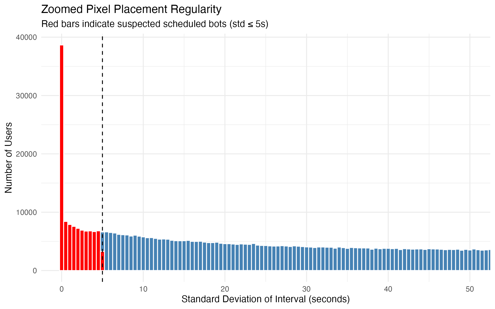
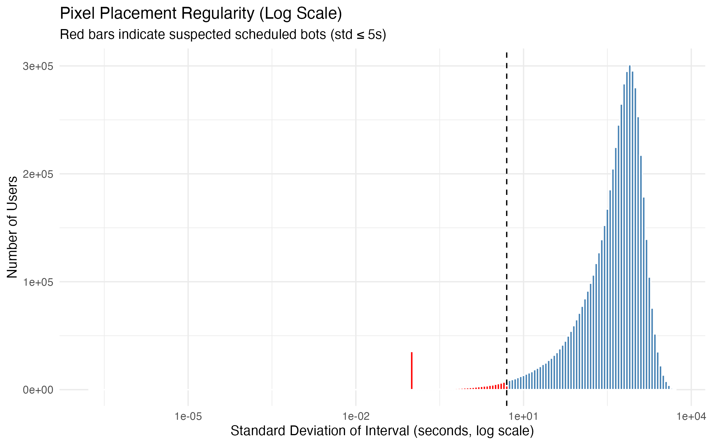
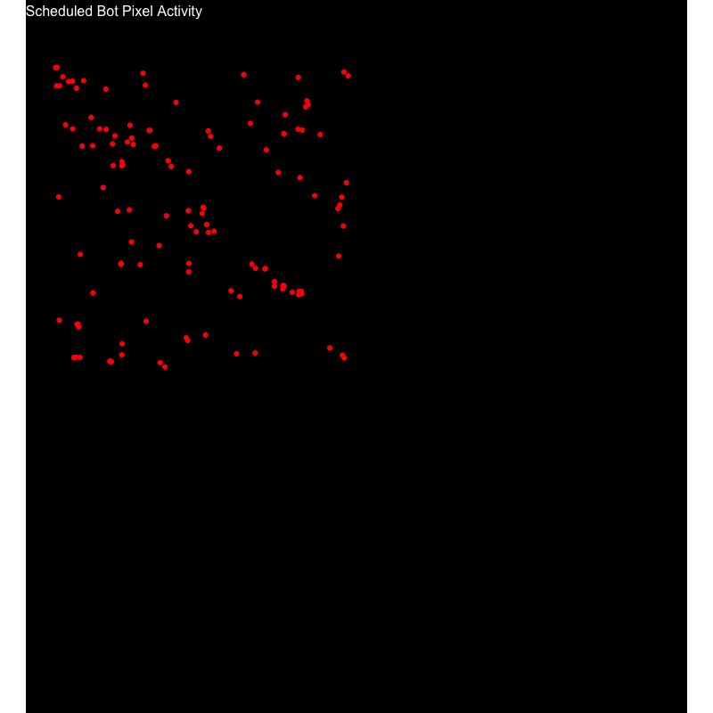
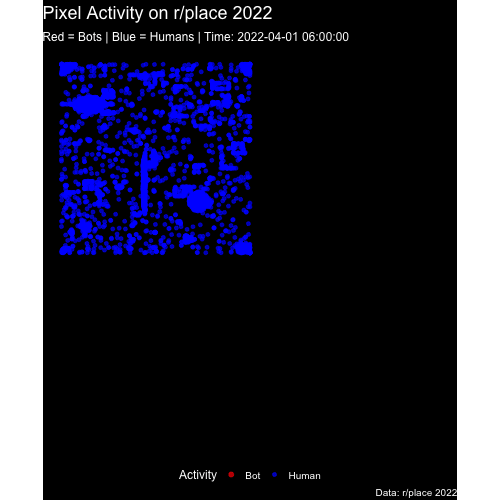
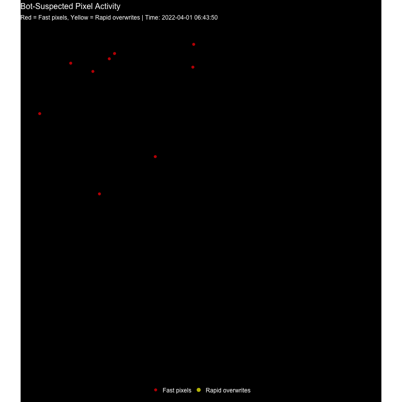
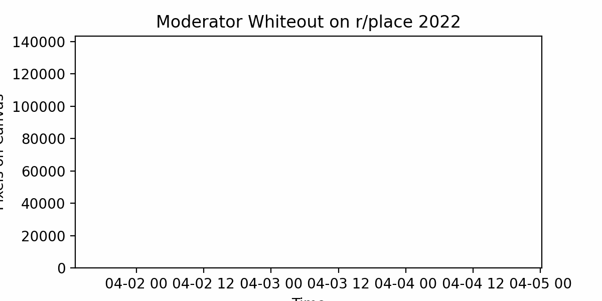

# Assessment Four 

## Bot-Suspected Activity

#### Introduction

**Bot-Suspected Activity** refers to pixels placed at rates far beyond normal human capability, indicating automated or coordinated actions. These pixels rapidly fill areas, overwrite other users, and appear in dense bursts, often targeting high-visibility regions of the r/place canvas. Normal human activity is slower, more sporadic, and rarely overwrites the same pixel repeatedly within seconds.

Down below identifies types of bot behavior, starting with **scheduled pixel placements**.

------------------------------------------------------------------------

### Scheduled Bots (Visuals made in R)

Scheduled bots place pixels with pretty accurate regular timing, often hitting the cooldown limit almost perfectly. This results in near-zero variance in the interval between pixel placements for a given user.

**Script**: Full script on Github: [W](https://github.com/username/CS369/blob/main/Week4Script.py)[eek4ScheduledScript.py onGitHub](https://github.com/sylviadu2552/CSC369/blob/master/Week4/Week4_Scheduled_Script.py)

This script analyzes r/place pixel placements to detect unusual activity. It looks at how quickly users place pixels and the consistency of their timing. Users who place pixels very rapidly with low variation in timing are flagged as potentially automated or part of a coordinated effort. The script processes the data in manageable chunks, calculates time intervals between each placement for every user, and aggregates statistics like the mean and standard deviation of these intervals. In the end, it produces a set of CSVs showing user-level stats and a list of suspected bots, which can be used for further analysis or visualization of irregular activity as done below.

### Histogram of Standard Deviation of Pixel Placement Intervals

```{r}

```

To highlight highly regular activity, we can zoom in on the low-standard-deviation region (≤ 5 seconds), which corresponds to the most likely scheduled bots. (Users with SD's of 0 was rescaled to 0.1 to show on the graph as the log of 0 is undefined.

```{r}

```

From the histogram, we can see that a small subset of users repeatedly place pixels with extremely low variance, which would be consistent with automated scripts. Below is a gif of suspected scheduled bots with their respective location and time on r/place.

```{r}

```

This may seem like a lot of suspected bots, but when compared to the amount of humans (users not suspected to be bots), the number is relatively small.

```{r}

```

### Example of Scheduled Bot Activity

One noticeable cluster of scheduled bot activity appeared around the center of the canvas shortly after the first canvas expansion. These bots rapidly filled areas near the Trans Pride flag and the American flag. Another noticeable cluster is around the corners of the first canvas, which also had notable artworks like the "connection lost" artwork and the "r/borderland" logo.

## Cooldown Breaking Bots (Visuals made in R)

A second type of bot behavior would occur when users repeatedly place pixels faster than allowed by the cool down (5 minutes).These accounts may appear human at first glance, but bursts of rapid pixel placement violate the platform rules.

**Script**: Full script on Github: [W](https://github.com/username/CS369/blob/main/Week4Script.py)[eek4ScriptCooldown.py onGitHub](https://github.com/sylviadu2552/CSC369/blob/master/Week4/Week4_Cooldown_Script.py)

This script identifies suspected bot activity on r/place by checking whether users place pixels faster than the allowed cooldown times. It first determines the full time range of the dataset, then processes the data in manageable chunks to reduce memory usage. For each user, it calculates the time difference between consecutive pixel placements. If a placement happens faster than the cooldown rules allow, it is flagged as a suspected bot. All flagged placements across chunks are collected and saved to a CSV, which can be used for visualization or further analysis. This approach allows us to efficiently detect automated or coordinated activity while keeping the process reproducible.

**Visualization of Suspected Bots:**

Below is a gif of suspected cooldown breaking bots with their respective location and time on r/place.

\- Pixels flagged in **yellow** represent rapid overwrites, while **red** represents fast pixel placements.

```{r}

```

### Example of Cooldown Breaking Bot Activity

Similar to the scheduled bot clusters, one noticeable cluster of scheduled bot activity appeared around the center of the canvas near the Trans Pride flag and the American flag. Another noticeable cluster is near the bottom left of the fully expanded canvas, where the large France flag was located.

# Moderator Intervention

Moderators on r/place removed pixels at various times to enforce rules or limit vandalism. Unlike scheduled bots, this activity is concentrated in bursts corresponding to whiteout events rather than consistent, precise timing. This results in visible spikes in the number of pixels removed over short periods.

Full script on Github: [W](https://github.com/username/CS369/blob/main/Week4Script.py)[eek4Mod.py onGitHub](https://github.com/sylviadu2552/CSC369/blob/master/Week4/Week4_Mod_script.py)

This script reads a summary CSV of pixels removed over time, downsamples the data to reduce memory usage, and creates an animated GIF showing how the moderator whiteout progressed across the canvas. Each frame represents a snapshot of total pixels removed up to that point in time. The output GIF allows us to visualize both the timing and intensity of moderator intervention across the r/place event.

**Visualization of Moderator Whiteout Over Time**

Below is a GIF showing the cumulative whiteout activity throughout r/place 2022. Peaks correspond to intense moderator interventions, highlighting areas of the canvas where rules were actively enforced:

```{r}

```

### Example of Mod Intervention Activity

Several spikes occurred shortly after large collaborative artworks were created, suggesting moderators removed pixels that violated r/place rules or corrected accidental overwrites. One of the most noticeable spikes is towards the end when the moderators decided to change the palette to white only and white out all of r/place.
